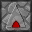

Additions & changes to the [Faithful](minecraft.curseforge.com/projects/faithful-32x) resource pack for Minecraft.

## Observer block

front, powered: 

side:  

top:  

## Sticky Piston block

side: 

## Clear glass

Removed glass streaks:

plain | black | white | purple
------|-------|-------|-------
 |  |  | 

## Hopper direction

The inside of a hopper indicates the direction of its output. E.g. a hopper pointed upward: 

