Additions & changes to the [Faithful](minecraft.curseforge.com/projects/faithful-32x) resource pack for Minecraft 1.13.

## Observer block

front, powered: 

side: 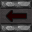 

top: 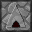 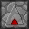

## Sticky Piston block

side: 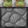

## Clear glass

Removed glass streaks:

plain | black | white | purple
------|-------|-------|-------
 | 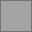 |  | 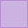

<a href="clear-glass/screenshot-clear.png" target="_blank">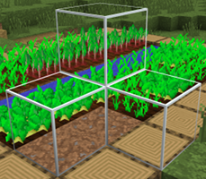</a>

<a href="clear-glass/screenshot.png" target="_blank">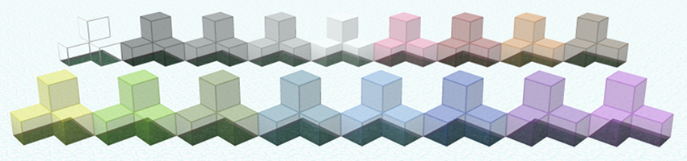</a>

## Hopper direction

The inside of a hopper indicates the direction of its output. E.g. a hopper pointed upward: 

<a href="hopper-direction/screenshot.png" target="_blank">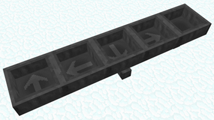</a>

## Redstone power level

Redstone lines are labeled with their current strength:

<a href="redstone-power/screenshot.png" target="_blank">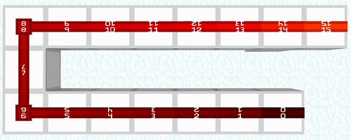</a>

> Redstone resource pack above is [CodeCrafted](http://codecrafted.net).

## 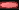 Rainbow experience bar

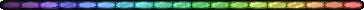
